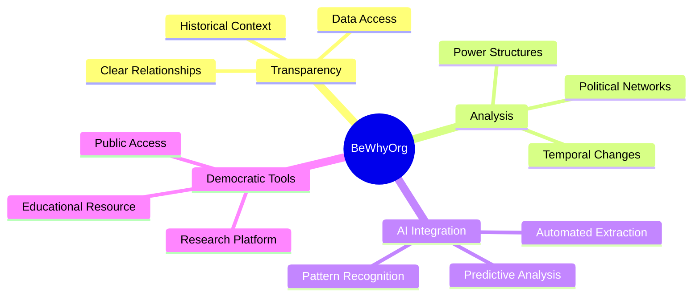

# BeWhyOrg Project Overview

## Vision

BeWhyOrg aims to create unprecedented transparency in Portuguese governance by mapping and analyzing political relationships, institutional evolution, and governmental transitions from 1736 to present day.

## Core Objectives

## Project Scope

### Phase 1: Core Infrastructure
- Base data models
- Essential relationships
- API foundation
- Basic UI

### Phase 2: Data Population
- Historical data import
- Document processing
- Relationship mapping
- Quality validation

### Phase 3: AI Enhancement
- Automated extraction
- Pattern recognition
- Network analysis
- Predictive modeling

### Phase 4: Public Platform
- Research tools
- Visualization
- API access
- Educational resources

## Technical Foundation

### Backend
- Laravel 11
- PostgreSQL
- Python for data processing
- AI/ML integration

### Frontend
- Modern SPA
- Interactive visualizations
- Responsive design
- Accessibility focus

## Data Sources

1. **Primary Sources**
   - Diário da República
   - Official government records
   - Legislative documents

2. **Secondary Sources**
   - Wikipedia
   - Wikidata
   - Academic publications
   - Historical records

3. **Derived Data**
   - AI-generated relationships
   - Network analysis
   - Pattern recognition
   - Temporal correlations

## Impact Areas

### Research
- Political science
- Historical analysis
- Network theory
- Democratic studies

### Education
- Civic education
- Political literacy
- Historical context
- Democratic processes

### Transparency
- Power structures
- Decision making
- Political networks
- Institutional evolution

### Innovation
- AI in governance
- Data-driven analysis
- Democratic tools
- Public engagement

## Success Metrics

1. **Data Quality**
   - Accuracy rate
   - Coverage depth
   - Update frequency
   - Source validation

2. **System Performance**
   - Query response time
   - Data processing speed
   - API reliability
   - System uptime

3. **User Engagement**
   - Active researchers
   - Public queries
   - Data contributions
   - Feature usage

4. **Impact Metrics**
   - Academic citations
   - Media references
   - Public policy influence
   - Educational adoption

## Future Directions

### Technical Evolution
- Advanced AI integration
- Real-time processing
- Enhanced visualization
- Predictive analytics

### Scope Expansion
- European integration
- Global comparisons
- Additional entities
- Deeper relationships

### Platform Growth
- Research tools
- API ecosystem
- Educational resources
- Community features

### Impact Enhancement
- Academic partnerships
- Policy influence
- Public engagement
- Democratic tools