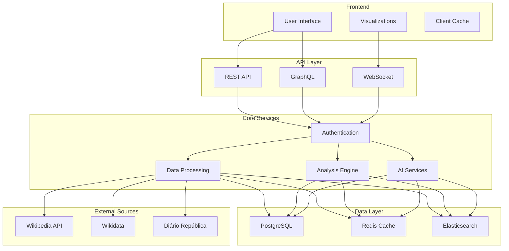

# System Architecture

## High-Level Overview

```mermaid
graph TB
    subgraph Frontend
        UI[User Interface]
        VIZ[Visualizations]
        CACHE[Client Cache]
    end
    
    subgraph API Layer
        REST[REST API]
        GQL[GraphQL]
        WS[WebSocket]
    end
    
    subgraph Core Services
        AUTH[Authentication]
        PROC[Data Processing]
        ANAL[Analysis Engine]
        AI[AI Services]
    end
    
    subgraph Data Layer
        PG[PostgreSQL]
        REDIS[Redis Cache]
        ES[Elasticsearch]
    end
    
    subgraph External Sources
        WIKI[Wikipedia API]
        WDATA[Wikidata]
        DR[Diário República]
    end

    UI --> REST & GQL
    VIZ --> WS
    REST & GQL & WS --> AUTH
    AUTH --> PROC & ANAL & AI
    PROC & ANAL & AI --> PG & REDIS & ES
    PROC --> WIKI & WDATA & DR
```

[Rest of the file content remains the same...]