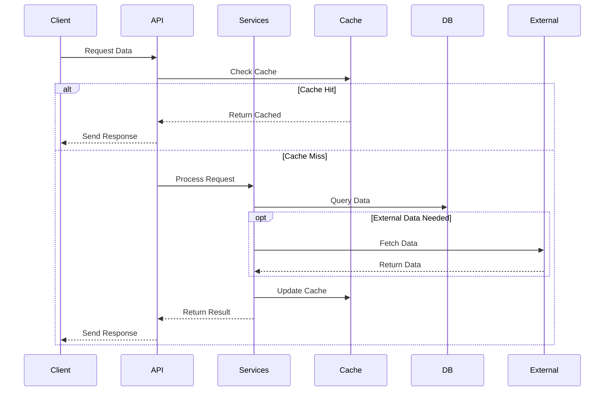
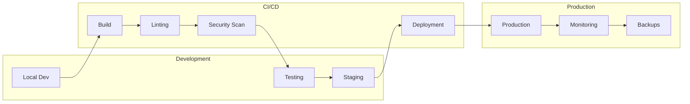

# System Architecture

## High-Level Overview

```mermaid
graph TB
    subgraph Frontend
        UI[User Interface]
        VIZ[Visualizations]
        CACHE[Client Cache]
    end
    
    subgraph API Layer
        REST[REST API]
        GQL[GraphQL]
        WS[WebSocket]
    end
    
    subgraph Core Services
        AUTH[Authentication]
        PROC[Data Processing]
        ANAL[Analysis Engine]
        AI[AI Services]
    end
    
    subgraph Data Layer
        PG[PostgreSQL]
        REDIS[Redis Cache]
        ES[Elasticsearch]
    end
    
    subgraph External Sources
        WIKI[Wikipedia API]
        WDATA[Wikidata]
        DR[Diário República]
    end

    UI --> REST & GQL
    VIZ --> WS
    REST & GQL & WS --> AUTH
    AUTH --> PROC & ANAL & AI
    PROC & ANAL & AI --> PG & REDIS & ES
    PROC --> External Sources
```

## Component Details

### Frontend Layer
- Modern SPA architecture
- Real-time data updates
- Interactive visualizations
- Progressive enhancement
- Offline capabilities

### API Layer
- RESTful endpoints
- GraphQL flexibility
- WebSocket real-time
- Rate limiting
- Caching strategy

### Core Services
- Authentication/Authorization
- Data processing pipeline
- Analysis engine
- AI/ML services
- Event handling

### Data Layer
- PostgreSQL primary store
- Redis caching
- Elasticsearch indexing
- Backup strategy
- Data integrity

## Data Flow



## Security Architecture

### Authentication
- JWT tokens
- OAuth2 integration
- Role-based access
- API keys
- Rate limiting

### Data Protection
- Encryption at rest
- TLS in transit
- Data anonymization
- Access logging
- Audit trails

## Scalability

### Horizontal Scaling
- Stateless services
- Load balancing
- Service discovery
- Container orchestration
- Auto-scaling

### Vertical Optimization
- Query optimization
- Cache strategies
- Resource allocation
- Performance monitoring
- Bottleneck analysis

## Monitoring & Logging

### System Health
- Service status
- Performance metrics
- Resource usage
- Error rates
- Response times

### Data Quality
- Validation checks
- Consistency monitoring
- Update frequency
- Coverage metrics
- Source reliability

## Development Pipeline



## Integration Points

### External APIs
- Wikipedia API
- Wikidata Query Service
- Diário República
- Government portals
- Academic databases

### Internal Services
- Authentication
- Data processing
- Analysis engine
- Search service
- Cache layer

## Future Architecture

### Planned Enhancements
- Machine learning pipeline
- Real-time analytics
- Advanced caching
- Distributed processing
- Enhanced security

### Scalability Plans
- Service mesh
- Edge computing
- Global CDN
- Database sharding
- Event streaming

## Technical Specifications

### Backend Stack
- PHP 8.4
- Laravel 11
- PostgreSQL 16
- Redis 7
- Python 3.12

### Frontend Stack
- TypeScript
- React/Vue
- D3.js
- TailwindCSS
- PWA support

### Infrastructure
- Docker containers
- Kubernetes orchestration
- Cloud-native design
- Multi-region support
- Auto-scaling