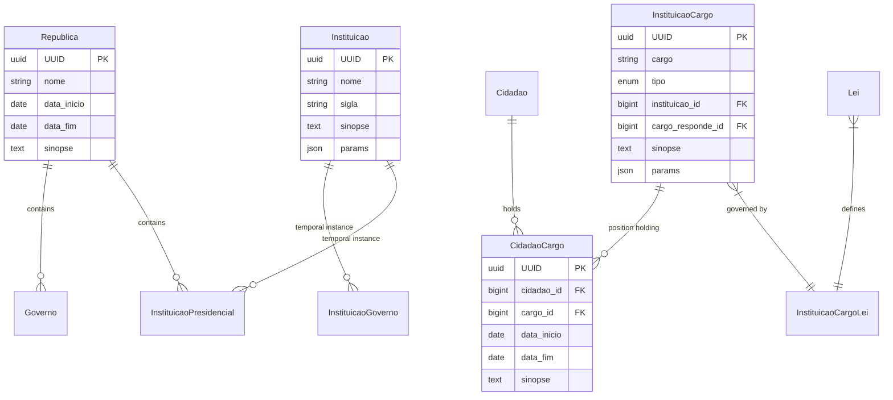
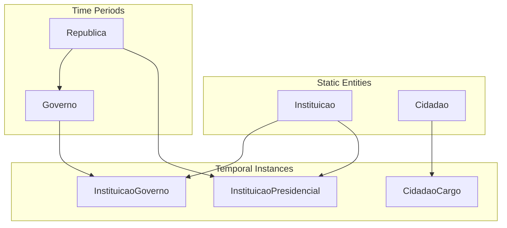

# Data Model

## Core Entities



## Temporal Model

### Time-Based Relationships



## Schema Details

### Instituicao
Core institution entity representing permanent organizational structures.

```sql
CREATE TABLE instituicoes (
    id BIGSERIAL PRIMARY KEY,
    uuid UUID UNIQUE NOT NULL,
    nome VARCHAR NOT NULL,
    sigla VARCHAR,
    sinopse TEXT,
    params JSONB,
    created_at TIMESTAMP,
    updated_at TIMESTAMP
);
```

### InstituicaoCargo
Position definitions within institutions.

```sql
CREATE TABLE instituicao_cargos (
    id BIGSERIAL PRIMARY KEY,
    uuid UUID UNIQUE NOT NULL,
    cargo VARCHAR NOT NULL,
    tipo ENUM('instituicao', 'instituicao_legislatura', 
              'instituicao_presidencial', 'instituicao_governo'),
    instituicao_id BIGINT REFERENCES instituicoes(id),
    cargo_responde_id BIGINT REFERENCES instituicao_cargos(id),
    sinopse TEXT,
    params JSONB,
    created_at TIMESTAMP,
    updated_at TIMESTAMP
);
```

## Data Integrity

### Foreign Key Relationships
- Strict referential integrity
- Cascade updates where appropriate
- Soft deletes for historical preservation
- Temporal consistency checks

### Validation Rules
1. Date ranges must be valid
2. No overlapping positions
3. Hierarchical integrity
4. Required relationships

## Query Patterns

### Position History
```sql
SELECT 
    c.nome_completo,
    ic.cargo,
    cc.data_inicio,
    cc.data_fim
FROM cidadao_cargos cc
JOIN cidadaos c ON cc.cidadao_id = c.id
JOIN instituicao_cargos ic ON cc.cargo_id = ic.id
WHERE c.uuid = :cidadao_uuid
ORDER BY cc.data_inicio;
```

### Institution Timeline
```sql
SELECT 
    i.nome,
    ig.data_inicio,
    ig.data_fim,
    g.nome as governo
FROM instituicoes i
JOIN instituicao_governos ig ON i.id = ig.instituicao_id
JOIN governos g ON ig.governo_id = g.id
WHERE i.uuid = :instituicao_uuid
ORDER BY ig.data_inicio;
```

## Data Evolution

### Version Control
- Schema migrations
- Data migrations
- Rollback capabilities
- Change tracking

### Historical Preservation
- Temporal data retention
- Audit logging
- Change history
- Source tracking

## AI Integration Points

### Entity Recognition
```python
def extract_position_holders(text: str) -> List[Dict]:
    """
    Extract position holders from unstructured text.
    Returns list of {cargo, nome, data_inicio, data_fim}
    """
    # AI processing logic
    pass
```

### Relationship Mapping
```python
def infer_relationships(cargo_id: int) -> List[Dict]:
    """
    Infer relationships between positions
    Returns list of {cargo_from, cargo_to, relationship_type}
    """
    # AI relationship inference
    pass
```

## Data Quality

### Validation Rules
1. Complete dates where possible
2. Consistent naming
3. Required relationships
4. Hierarchical integrity

### Quality Metrics
- Completeness
- Accuracy
- Consistency
- Timeliness

## Future Extensions

### Planned Entities
- Legislative acts
- Political parties
- International relations
- Policy areas

### Enhanced Relationships
- Influence networks
- Power structures
- Decision flows
- Policy impacts