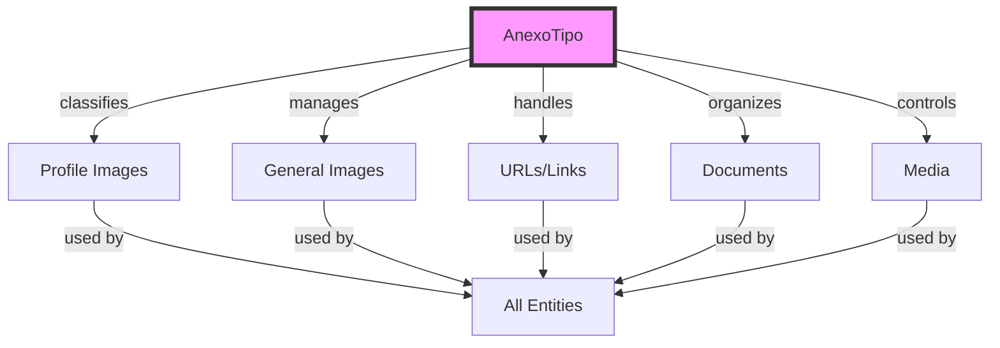
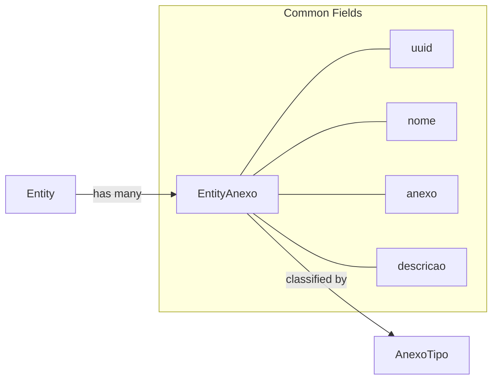
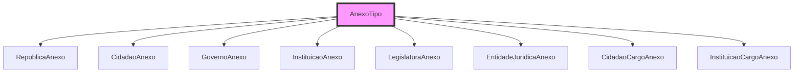
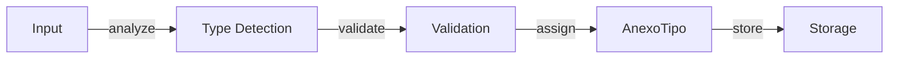

# AnexoTipo Entity Documentation

## Overview

`AnexoTipo` serves as the central classification system for all attachments and references across the platform. It defines and manages different types of media, documents, and links that can be associated with any major entity (Cidadao, Republica, Governo, etc.). This standardization ensures consistent handling of external resources and proper content organization.

## Core Concept



## Database Schema

### Main Table: `anexo_tipos`

```sql
CREATE TABLE anexo_tipos (
    id BIGINT PRIMARY KEY,
    tipo VARCHAR(50) UNIQUE,
    descricao VARCHAR(150) NULL,
    params JSON NULL,
    created_at TIMESTAMP,
    updated_at TIMESTAMP
);

COMMENT ON TABLE anexo_tipos IS 'Organização de Anexos, de links paths em server ou base64';
```

### Standard Types
```php
AnexoTipo::create(['tipo' => 'profile',   'descricao' => 'Imagem minima para procurar para preencher front-end']);
AnexoTipo::create(['tipo' => 'image',     'descricao' => 'Imagens em geral, referências em tabela Própria']);
AnexoTipo::create(['tipo' => 'url',       'descricao' => 'Url da Internet']);
AnexoTipo::create(['tipo' => 'path',      'descricao' => 'Path do servidor']);
AnexoTipo::create(['tipo' => 'document',  'descricao' => 'Documento Remoto']);
AnexoTipo::create(['tipo' => 'base64',    'descricao' => 'Encode Base64']);
AnexoTipo::create(['tipo' => 'video',     'descricao' => 'Vídeo']);
AnexoTipo::create(['tipo' => 'audio',     'descricao' => 'Áudio']);
```

## Implementation Across Entities

### Common Anexo Table Structure


### Entity-Specific Tables



## Usage Patterns

### Standard Implementation
```php
class EntityAnexo extends Model
{
    protected $fillable = [
        'uuid',
        'nome',
        'entity_id',
        'anexo_tipo_id',
        'anexo',
        'descricao'
    ];

    public function anexoTipo(): BelongsTo
    {
        return $this->belongsTo(AnexoTipo::class);
    }
}
```

### Common Migration Pattern
```sql
CREATE TABLE entity_anexos (
    id BIGINT PRIMARY KEY,
    uuid UUID UNIQUE,
    nome VARCHAR(255),
    entity_id BIGINT,
    anexo_tipo_id BIGINT,
    anexo VARCHAR(255),
    descricao VARCHAR(255) NULL,
    FOREIGN KEY (anexo_tipo_id) REFERENCES anexo_tipos(id)
);
```

## Content Organization Strategy

### By Type Purpose
1. **Profile Images**
   - Minimal required images
   - Frontend display optimization
   - Quick loading thumbnails

2. **General Media**
   - Supporting documentation
   - Historical photographs
   - Supplementary materials

3. **External References**
   - URLs to official sources
   - Related documentation
   - External databases

4. **Server Resources**
   - Local document storage
   - Processed materials
   - Generated content

## AI Integration Points

### Content Classification


### Automated Processing
1. **Image Processing**
   - Format detection
   - Thumbnail generation
   - Metadata extraction

2. **Document Analysis**
   - Content classification
   - Text extraction
   - Reference linking

3. **URL Management**
   - Link validation
   - Content preview
   - Metadata scraping

## API Endpoints

### Core Operations
```graphql
type AnexoTipo {
    id: ID!
    tipo: String!
    descricao: String
    params: JSON
}

type EntityAnexo {
    uuid: ID!
    nome: String!
    anexo: String!
    anexoTipo: AnexoTipo!
    descricao: String
}
```

## Usage Examples

### Type Validation
```php
public function validateAnexo($anexo, $tipo) {
    $anexoTipo = AnexoTipo::where('tipo', $tipo)->firstOrFail();
    
    switch ($tipo) {
        case 'profile':
            return validateImage($anexo, ['max_size' => '1MB']);
        case 'url':
            return validateUrl($anexo);
        case 'document':
            return validateDocument($anexo);
    }
}
```

### Attachment Creation
```php
public function attachMedia($entity, $file, $tipo = 'document') {
    $anexoTipo = AnexoTipo::where('tipo', $tipo)->first();
    
    return $entity->anexos()->create([
        'uuid' => Str::uuid(),
        'nome' => $file->getClientOriginalName(),
        'anexo_tipo_id' => $anexoTipo->id,
        'anexo' => $file->store('attachments'),
        'descricao' => "Uploaded {$tipo} for {$entity->nome}"
    ]);
}
```

## Future Enhancements

1. **Advanced Type System**
   - Nested type hierarchies
   - Custom type validation rules
   - Type-specific metadata schemas

2. **AI-Powered Features**
   - Automatic type detection
   - Content categorization
   - Metadata extraction

3. **Storage Optimization**
   - Type-based storage strategies
   - Automatic format conversion
   - Content deduplication

4. **Security Enhancements**
   - Type-based access control
   - Content validation rules
   - Format-specific scanning