# Cidadao Entity Documentation

## Overview

`Cidadao` represents individuals who have held public positions in Portuguese institutions. A citizen can simultaneously hold multiple positions within the same government period, creating a rich network of responsibilities and relationships.

## Core Concept


## Database Schema

### Main Table: `cidadaos`

```sql
CREATE TABLE cidadaos (
    id BIGINT PRIMARY KEY,
    nome_completo VARCHAR NOT NULL,
    nome VARCHAR NOT NULL COMMENT 'Nome comum/conhecido',
    data_nascimento DATE NULL,
    local_nascimento VARCHAR NULL,
    data_morte DATE NULL,
    local_morte VARCHAR NULL,
    genero CHAR(1) NULL,
    sinopse TEXT NULL,
    params JSON NULL
);

COMMENT ON TABLE cidadaos IS 'Individual citizens who held public positions';
```

## Position Holdings

A citizen can hold multiple positions simultaneously:

```mermaid
graph TD
    subgraph "XXIII Governo"
        C[António Costa] --> |holds| PM[Primeiro Ministro]
        C --> |holds| D[Deputado]
        C --> |holds| PS[Presidente PS]
        
        PM --> |period| T1[2022-2024]
        D --> |period| T1
        PS --> |period| T1
    end
```



### Key Relationships

1. **Multiple Positions**
   - Can hold several positions simultaneously
   - Positions can be in different institutions
   - Each position has its temporal context

2. **Career Progression**
   - Track position changes over time
   - Map institutional movements
   - Document responsibility evolution

3. **Institutional Network**
   - Connections through positions
   - Inter-institutional relationships
   - Power structure mapping

## Example Queries

### Current Positions
```sql
SELECT 
    c.nome,
    ic.cargo,
    i.nome as instituicao,
    cc.inicio,
    cc.fim
FROM cidadaos c
JOIN cidadao_cargos cc ON c.id = cc.cidadao_id
JOIN instituicao_cargos ic ON cc.cargo_id = ic.id
JOIN instituicoes i ON ic.instituicao_id = i.id
WHERE c.id = [cidadao_id]
AND (cc.fim IS NULL OR cc.fim > CURRENT_DATE)
ORDER BY cc.inicio;
```

### Career Timeline
```sql
WITH positions AS (
    SELECT 
        c.nome,
        ic.cargo,
        i.nome as instituicao,
        g.nome as governo,
        cc.inicio,
        cc.fim,
        COUNT(*) OVER (
            PARTITION BY g.id
        ) as concurrent_positions
    FROM cidadaos c
    JOIN cidadao_cargos cc ON c.id = cc.cidadao_id
    JOIN instituicao_cargos ic ON cc.cargo_id = ic.id
    JOIN instituicao_governos ig ON ic.instituicao_id = ig.id
    JOIN instituicoes i ON ig.instituicao_id = i.id
    JOIN governos g ON ig.governo_id = g.id
    WHERE c.id = [cidadao_id]
)
SELECT * FROM positions
ORDER BY inicio, governo;
```

## AI Integration Points

### Career Analysis
- Position pattern recognition
- Power network mapping
- Career trajectory prediction

### Pattern Recognition


## Future Enhancements

1. **AI-Powered Features**
   - Career pattern analysis
   - Relationship mapping
   - Influence tracking

2. **Visualization Tools**
   - Career timelines
   - Position networks
   - Power structure maps

3. **Integration Points**
   - Social network analysis
   - Historical context mapping
   - Cross-institutional relationships