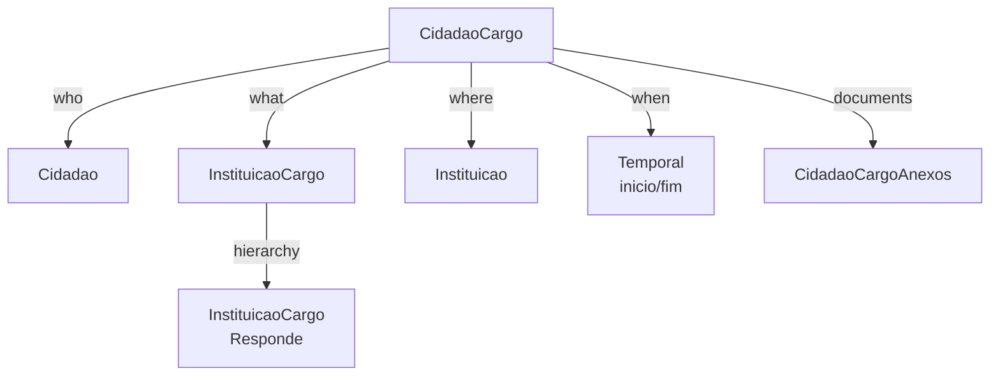
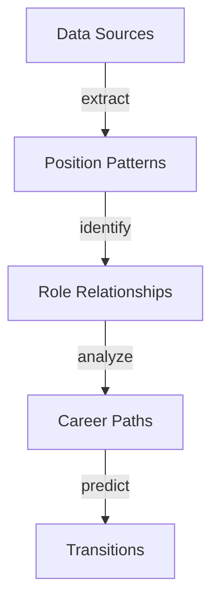

# CidadaoCargo Entity Documentation

## Overview

`CidadaoCargo` represents the temporal relationship between citizens and institutional positions. It tracks when individuals held specific roles within government institutions, forming a comprehensive career timeline for Portuguese public servants and officials.

## Core Concept



## Database Schema

### Main Table: `cidadao_cargos`

```sql
CREATE TABLE cidadao_cargos (
    id BIGINT PRIMARY KEY,
    cidadao_id BIGINT FOREIGN KEY,
    cargo_id BIGINT FOREIGN KEY COMMENT 'From instituicao_cargos',
    instituicao_id BIGINT NULL FOREIGN KEY,
    inicio DATE NULL COMMENT 'Nullable for legislature/presidential dependencies',
    fim DATE NULL,
    sinopse TEXT NULL,
    created_at TIMESTAMP,
    updated_at TIMESTAMP
);

COMMENT ON TABLE cidadao_cargos IS 'Maps citizen careers with positions held, legislatures, etc.';
```

#### Key Fields Explained

- `cidadao_id`: Link to the person
- `cargo_id`: Position held (from `instituicao_cargos`)
- `instituicao_id`: Institution where position was held
- `inicio`/`fim`: Term dates
- `sinopse`: Position-specific notes

## Temporal Aspect

Position holdings follow institutional cycles:


### Example Timeline

1. Government Formation: "XXIII Governo (2022-present)"
2. Institution Instance: "Ministério das Finanças do XXIII Governo"
3. Position Definition: "Ministro das Finanças"
4. Position Assignment: "Fernando Medina (2022-03-30 - present)"

## Related Tables

### `instituicao_cargos`
Defines available positions:
```sql
CREATE TABLE instituicao_cargos (
    id BIGINT PRIMARY KEY,
    uuid UUID UNIQUE,
    cargo VARCHAR,
    tipo ENUM('instituicao', 'instituicao_legislatura', 
              'instituicao_presidencial', 'instituicao_governo'),
    instituicao_id BIGINT,
    cargo_responde_id BIGINT NULL,
    sinopse TEXT NULL
);
```

### `cidadao_cargo_anexos`
Position-specific documents:
```sql
CREATE TABLE cidadao_cargo_anexos (
    id BIGINT PRIMARY KEY,
    uuid UUID UNIQUE,
    cidadao_cargo_id BIGINT,
    anexo_tipo_id BIGINT,
    anexo VARCHAR(255),
    descricao VARCHAR(255) NULL
);
```

## AI Integration Points

### Data Analysis
- Career progression patterns
- Position succession analysis
- Institutional mobility studies

### Pattern Recognition


### LLM Training Focus
1. **Position Recognition**
   - Title variations
   - Role equivalences
   - Hierarchical relationships

2. **Career Analysis**
   - Common paths
   - Position transitions
   - Term patterns

## API Endpoints

### Key Queries
```graphql
type CidadaoCargo {
    cidadao: Cidadao!
    cargo: InstituicaoCargo!
    instituicao: Instituicao
    inicio: Date
    fim: Date
    sinopse: String
    anexos: [CidadaoCargoAnexo!]
}
```

### Common Operations
1. Career timeline retrieval
2. Position history analysis
3. Institution role mapping
4. Document management

## Usage Examples

### Career Timeline Query
```sql
SELECT 
    c.nome AS cidadao,
    ic.cargo AS posicao,
    i.nome AS instituicao,
    cc.inicio,
    cc.fim
FROM cidadao_cargos cc
JOIN cidadaos c ON cc.cidadao_id = c.id
JOIN instituicao_cargos ic ON cc.cargo_id = ic.id
LEFT JOIN instituicoes i ON cc.instituicao_id = i.id
WHERE c.id = [cidadao_id]
ORDER BY cc.inicio;
```

### Position Hierarchy
```sql
WITH RECURSIVE position_chain AS (
    SELECT id, cargo, cargo_responde_id, 1 as level
    FROM instituicao_cargos
    WHERE id = [cargo_id]
    UNION ALL
    SELECT ic.id, ic.cargo, ic.cargo_responde_id, pc.level + 1
    FROM instituicao_cargos ic
    JOIN position_chain pc ON ic.cargo_responde_id = pc.id
)
SELECT * FROM position_chain;
```

## Future Enhancements

1. **AI-Powered Features**
   - Career path prediction
   - Position recommendation
   - Succession planning

2. **Analytics Dashboard**
   - Career progression visualization
   - Position network mapping
   - Temporal analysis tools

3. **Integration Opportunities**
   - CV/Resume parsing
   - Public record matching
   - News media correlation