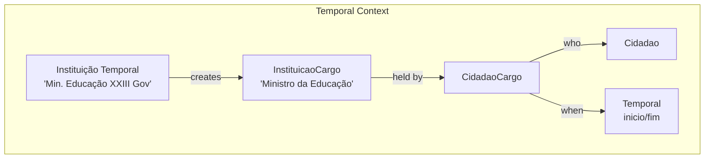
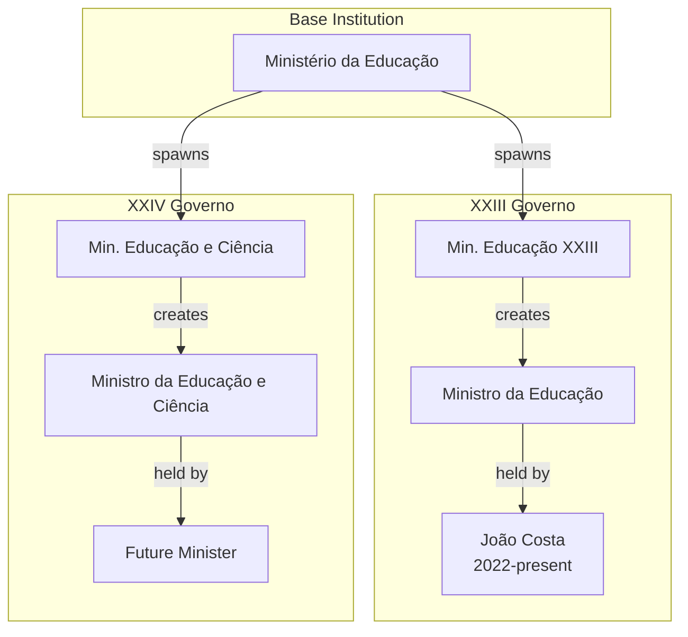
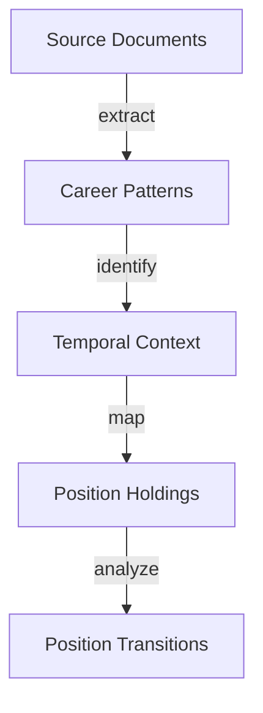

# CidadaoCargo Entity Documentation

## Overview

`CidadaoCargo` represents the temporal relationship between citizens and institutional positions. It maps individuals to positions within specific temporal instances of institutions (e.g., ministries in specific governments), creating a comprehensive historical record of public service careers.

## Core Concept



## Database Schema

### Main Table: `cidadao_cargos`

```sql
CREATE TABLE cidadao_cargos (
    id BIGINT PRIMARY KEY,
    cidadao_id BIGINT FOREIGN KEY,
    cargo_id BIGINT FOREIGN KEY COMMENT 'From instituicao_cargos',
    instituicao_id BIGINT NULL FOREIGN KEY,
    inicio DATE NULL COMMENT 'Nullable for legislature/presidential dependencies',
    fim DATE NULL,
    sinopse TEXT NULL,
    created_at TIMESTAMP,
    updated_at TIMESTAMP
);

COMMENT ON TABLE cidadao_cargos IS 'Maps citizens to positions within temporal institutional contexts';
```

#### Key Fields Explained

- `cidadao_id`: Link to the person
- `cargo_id`: Position held (from temporal instance's `instituicao_cargos`)
- `instituicao_id`: Temporal instance where position was held
- `inicio`/`fim`: Term dates
- `sinopse`: Position-specific notes

## Temporal Context Model

Position holdings exist within specific temporal contexts:



### Example Timeline

1. Base Institution: "Ministério da Educação" (permanent)
2. Temporal Instance: "Ministério da Educação do XXIII Governo" (2022-present)
3. Position: "Ministro da Educação" (specific to this instance)
4. Holder: "João Costa (2022-03-30 - present)"

## Usage Examples

### Career Timeline Query
```sql
WITH temporal_context AS (
    SELECT 
        cc.id as cargo_id,
        c.nome as cidadao,
        ic.cargo as posicao,
        i_base.nome as instituicao_base,
        i_temp.nome as instituicao_temporal,
        g.nome as governo,
        cc.inicio,
        cc.fim
    FROM cidadao_cargos cc
    JOIN cidadaos c ON cc.cidadao_id = c.id
    JOIN instituicao_cargos ic ON cc.cargo_id = ic.id
    JOIN instituicao_governos i_temp ON ic.instituicao_id = i_temp.id
    JOIN instituicoes i_base ON i_temp.instituicao_id = i_base.id
    JOIN governos g ON i_temp.governo_id = g.id
    WHERE c.id = [cidadao_id]
)
SELECT * FROM temporal_context
ORDER BY inicio, governo;
```

## AI Integration Points

### Career Analysis
- Track position evolution across governments
- Identify institutional transitions
- Map responsibility changes
- Analyze career progression patterns

### Pattern Recognition


## Future Enhancements

1. **AI-Powered Features**
   - Career trajectory analysis
   - Position evolution tracking
   - Institutional transition mapping

2. **Analytics Dashboard**
   - Multi-government career views
   - Position transformation tracking
   - Temporal analysis tools

3. **Integration Opportunities**
   - Cross-government position analysis
   - Historical role evolution tracking
   - Responsibility transition mapping