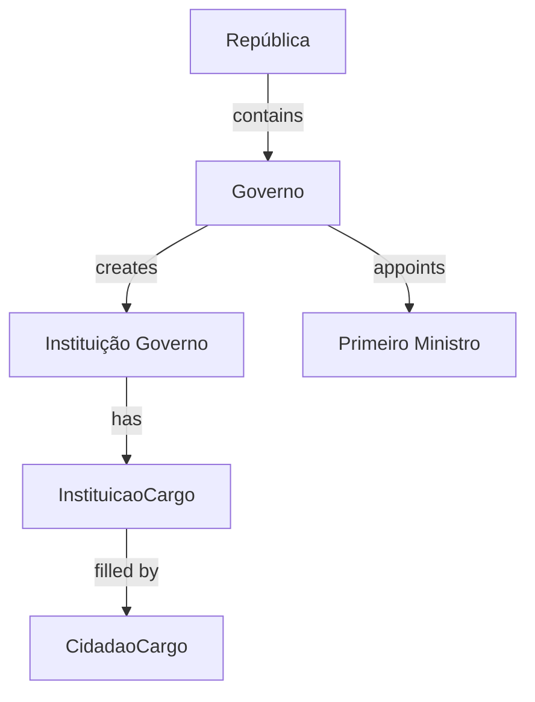
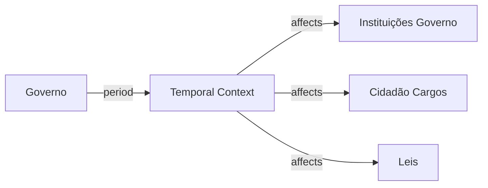
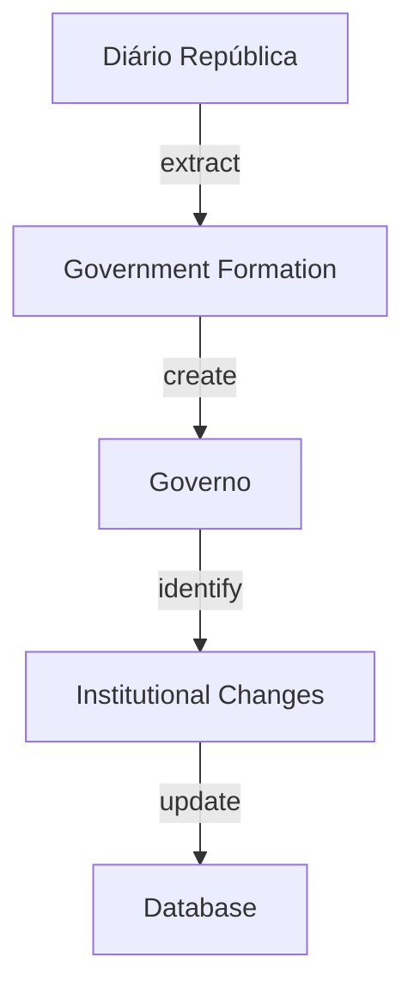

# Governo Entity Documentation

## Overview

`Governo` represents Portuguese governmental administrations. It tracks constitutional governments, their temporal boundaries, and relationships with institutions and position holders. This entity is fundamental for temporal context in institutional relationships.

## Core Concept



## Database Schema

### Main Table: `governos`

```sql
CREATE TABLE governos (
    id BIGINT PRIMARY KEY,
    uuid UUID UNIQUE INDEX,
    nome VARCHAR,
    numero INTEGER,
    republica_id BIGINT,
    data_inicio DATE,
    data_fim DATE NULL,
    primeiro_ministro_id BIGINT,
    sinopse TEXT NULL,
    params JSON NULL
);
```

#### Key Fields Explained

- `nome`: Official government designation
- `numero`: Constitutional government number
- `data_inicio`: Government start date
- `data_fim`: Government end date (NULL for current)
- `primeiro_ministro_id`: Link to Prime Minister's citizen record
- `params`: Additional metadata storage

## Temporal Aspect

Governments provide primary temporal context for institutional positions:



### Example Flow

1. New Government Formation
2. Institution Creation/Modification
3. Position Appointments
4. Legislative Actions

## Related Tables

### `governo_instituicoes`
Maps institutions to specific governments:
```sql
CREATE TABLE governo_instituicoes (
    governo_id BIGINT,
    instituicao_id BIGINT,
    data_inicio DATE,
    data_fim DATE NULL
);
```

### `governo_leis`
Tracks legislation during government periods:
```sql
CREATE TABLE governo_leis (
    governo_id BIGINT,
    lei_id BIGINT
);
```

## AI Integration Points

### Data Extraction
- Government formation details from official sources
- Institutional changes tracking
- Cabinet member identification

### Relationship Analysis


### LLM Training Focus
1. **Government Recognition**
   - Constitutional processes
   - Formation patterns
   - Transition handling

2. **Temporal Analysis**
   - Period determination
   - Overlap handling
   - Transition management

## API Endpoints

### Key Queries
```graphql
type Governo {
    nome: String!
    numero: Int!
    dataInicio: Date!
    dataFim: Date
    primeiroMinistro: Cidadao!
    instituicoes: [InstituicaoGoverno!]!
    leis: [Lei!]!
}
```

### Common Operations
1. Current government status
2. Historical government listing
3. Institution tracking
4. Cabinet composition

## Usage Examples

### Active Government Query
```sql
SELECT 
    g.nome,
    g.numero,
    c.nome as primeiro_ministro,
    g.data_inicio,
    COUNT(gi.instituicao_id) as num_instituicoes
FROM governos g
JOIN cidadaos c ON g.primeiro_ministro_id = c.id
LEFT JOIN governo_instituicoes gi ON g.id = gi.governo_id
WHERE g.data_fim IS NULL
GROUP BY g.id;
```

### Government Timeline
```sql
SELECT 
    g.numero,
    g.nome,
    g.data_inicio,
    g.data_fim,
    c.nome as primeiro_ministro,
    COUNT(DISTINCT gi.instituicao_id) as instituicoes,
    COUNT(DISTINCT gl.lei_id) as leis
FROM governos g
JOIN cidadaos c ON g.primeiro_ministro_id = c.id
LEFT JOIN governo_instituicoes gi ON g.id = gi.governo_id
LEFT JOIN governo_leis gl ON g.id = gl.governo_id
GROUP BY g.id
ORDER BY g.numero DESC;
```

## Future Enhancements

1. **AI-Driven Features**
   - Automatic government change detection
   - Cabinet reshuffling tracking
   - Policy continuity analysis

2. **Data Visualization**
   - Government timelines
   - Cabinet composition charts
   - Institution evolution graphs

3. **Integration Opportunities**
   - European Union context
   - International comparison tools
   - Policy impact tracking