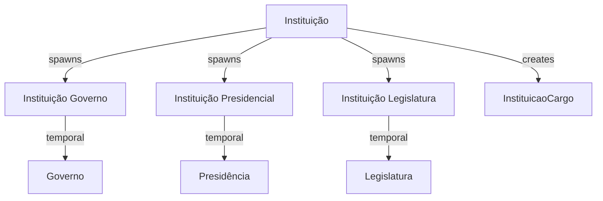
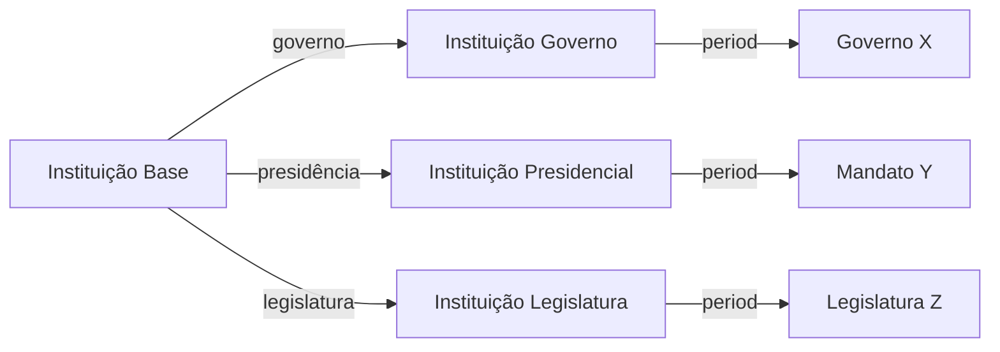
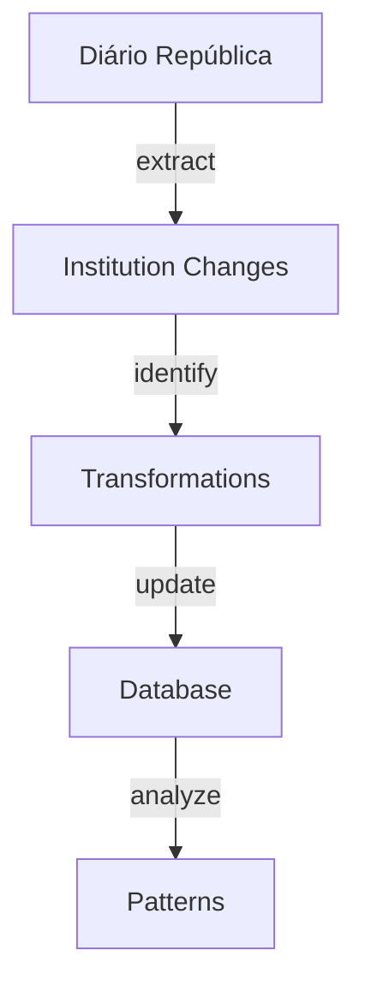

# Instituicao Entity Documentation

## Overview

`Instituicao` represents Portuguese state institutions - the foundational organizational units of government. These can be ministries, secretariats, councils, or other permanent state bodies that persist across different governments while adapting their specific forms.

## Core Concept



## Database Schema

### Main Table: `instituicoes`

```sql
CREATE TABLE instituicoes (
    id BIGINT PRIMARY KEY,
    uuid UUID UNIQUE INDEX,
    nome VARCHAR,
    sigla VARCHAR,
    tipo ENUM('executivo', 'legislativo', 'judicial', 'administrativo'),
    instituicao_superior_id BIGINT NULL,
    data_criacao DATE,
    data_extincao DATE NULL,
    sinopse TEXT NULL,
    params JSON NULL
);
```

#### Key Fields Explained

- `nome`: Official institution name
- `sigla`: Official abbreviation
- `tipo`: Institution type/branch
- `instituicao_superior_id`: Parent institution (hierarchical structure)
- `data_criacao`: Founding date
- `data_extincao`: Dissolution date (NULL if active)

## Temporal Aspect

Institutions spawn temporal instances for specific periods:



### Example Flow

1. Base Institution: "Ministério das Finanças"
2. Government Instance: "Ministério das Finanças do XXIII Governo"
3. Position Creation: "Ministro das Finanças"
4. Position Assignment: "Fernando Medina (2022-present)"

## Related Tables

### `instituicao_governos`
Links institutions to specific governments:
```sql
CREATE TABLE instituicao_governos (
    instituicao_id BIGINT,
    governo_id BIGINT,
    nome VARCHAR,
    sigla VARCHAR,
    data_inicio DATE,
    data_fim DATE NULL
);
```

### `instituicao_presidenciais`
Presidential period instances:
```sql
CREATE TABLE instituicao_presidenciais (
    instituicao_id BIGINT,
    presidencia_id BIGINT,
    nome VARCHAR,
    sigla VARCHAR,
    data_inicio DATE,
    data_fim DATE NULL
);
```

### `instituicao_legislaturas`
Legislative period instances:
```sql
CREATE TABLE instituicao_legislaturas (
    instituicao_id BIGINT,
    legislatura_id BIGINT,
    nome VARCHAR,
    sigla VARCHAR,
    data_inicio DATE,
    data_fim DATE NULL
);
```

## AI Integration Points

### Data Extraction
- Historical institution evolution
- Name/structure changes tracking
- Relationship mapping

### Relationship Analysis


### LLM Training Focus
1. **Institution Recognition**
   - Name variations
   - Historical context
   - Structural changes

2. **Relationship Mapping**
   - Hierarchical structures
   - Cross-government continuity
   - Functional equivalence

## API Endpoints

### Key Queries
```graphql
type Instituicao {
    nome: String!
    sigla: String!
    tipo: TipoInstituicao!
    instituicaoSuperior: Instituicao
    dataCriacao: Date!
    dataExtincao: Date
    governos: [InstituicaoGoverno!]!
    cargos: [InstituicaoCargo!]!
}
```

### Common Operations
1. Current institution structure
2. Historical evolution tracking
3. Position hierarchy
4. Cross-government comparison

## Usage Examples

### Institution Timeline
```sql
SELECT 
    i.nome,
    ig.nome as nome_governo,
    g.numero as governo_numero,
    ig.data_inicio,
    ig.data_fim
FROM instituicoes i
JOIN instituicao_governos ig ON i.id = ig.instituicao_id
JOIN governos g ON ig.governo_id = g.id
WHERE i.id = [instituicao_id]
ORDER BY ig.data_inicio;
```

### Hierarchical Structure
```sql
WITH RECURSIVE hierarchy AS (
    SELECT id, nome, instituicao_superior_id, 1 as level
    FROM instituicoes
    WHERE id = [root_id]
    UNION ALL
    SELECT i.id, i.nome, i.instituicao_superior_id, h.level + 1
    FROM instituicoes i
    JOIN hierarchy h ON i.instituicao_superior_id = h.id
)
SELECT * FROM hierarchy;
```

## Future Enhancements

1. **AI-Driven Features**
   - Automatic structure updates
   - Change prediction
   - Historical pattern analysis

2. **Data Visualization**
   - Organizational charts
   - Evolution timelines
   - Relationship networks

3. **Integration Opportunities**
   - European institution mapping
   - International comparisons
   - Cross-border relationships