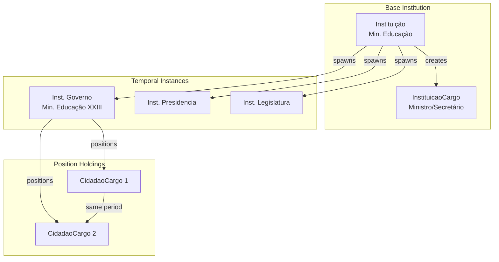
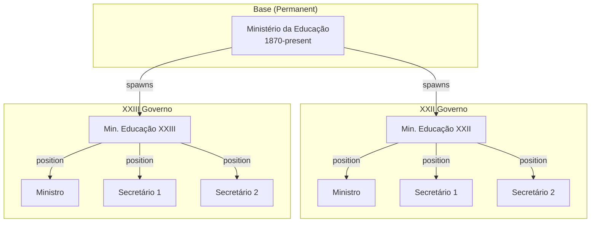
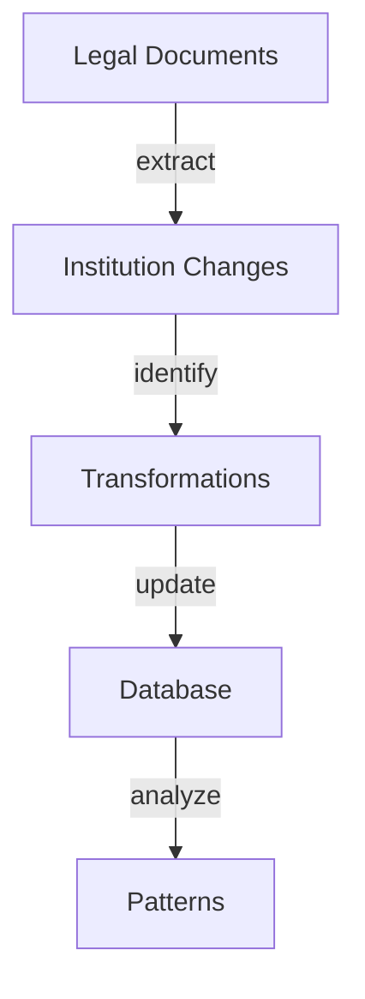

# Instituicao Entity Documentation

## Overview

`Instituicao` represents permanent state institutions that persist across different governments. Each base institution spawns temporal instances (government-specific, presidential, or legislative) while maintaining its core identity and organizational continuity.

## Core Concept



## Database Schema

### Main Table: `instituicoes`

```sql
CREATE TABLE instituicoes (
    id BIGINT PRIMARY KEY,
    uuid UUID UNIQUE INDEX,
    nome VARCHAR NOT NULL,
    sigla VARCHAR,
    tipo ENUM('instituicao', 'instituicao_legislatura', 'instituicao_presidencial', 'instituicao_governo'),
    instituicao_superior_id BIGINT NULL REFERENCES instituicoes(id),
    data_criacao DATE NOT NULL,
    data_extincao DATE NULL,
    sinopse TEXT NULL,
    params JSON NULL
);

COMMENT ON TABLE instituicoes IS 'Base institutions that persist across governments';
```

## Temporal Instances

Each base institution can spawn multiple temporal instances:



### Key Relationships

1. **Hierarchical Structure**
   - Base institutions can have parent/child relationships
   - Temporal instances inherit these relationships
   - Positions reflect the hierarchy

2. **Position Management**
   - Each temporal instance can define its positions
   - Multiple citizens can hold positions simultaneously
   - Positions can evolve within the temporal context

3. **Legal Framework**
   - Laws define institution structure
   - Temporal instances adapt to legal changes
   - Position authorities are legally defined

## Example Queries

### Institution Timeline
```sql
SELECT 
    i.nome as base_institution,
    ig.nome as temporal_instance,
    g.nome as government,
    ic.cargo as position,
    c.nome as holder,
    cc.inicio,
    cc.fim
FROM instituicoes i
JOIN instituicao_governos ig ON i.id = ig.instituicao_id
JOIN governos g ON ig.governo_id = g.id
JOIN instituicao_cargos ic ON ig.id = ic.instituicao_id
JOIN cidadao_cargos cc ON ic.id = cc.cargo_id
JOIN cidadaos c ON cc.cidadao_id = c.id
WHERE i.id = [instituicao_id]
ORDER BY g.numero, cc.inicio;
```

### Current Structure
```sql
WITH RECURSIVE hierarchy AS (
    SELECT 
        i.id, 
        i.nome, 
        i.instituicao_superior_id,
        ic.cargo as positions,
        1 as level
    FROM instituicoes i
    LEFT JOIN instituicao_cargos ic ON i.id = ic.instituicao_id
    WHERE i.data_extincao IS NULL
    UNION ALL
    SELECT 
        i.id,
        i.nome,
        i.instituicao_superior_id,
        ic.cargo,
        h.level + 1
    FROM instituicoes i
    LEFT JOIN instituicao_cargos ic ON i.id = ic.instituicao_id
    JOIN hierarchy h ON i.instituicao_superior_id = h.id
)
SELECT * FROM hierarchy;
```

## AI Integration Points

### Data Analysis
- Track institutional evolution
- Map position transformations
- Analyze structural patterns

### Pattern Recognition


## Future Enhancements

1. **AI-Powered Features**
   - Automatic structure updates
   - Change prediction
   - Historical pattern analysis

2. **Visualization Tools**
   - Organizational charts
   - Evolution timelines
   - Position networks

3. **Integration Points**
   - European institution mapping
   - International comparisons
   - Cross-border relationships