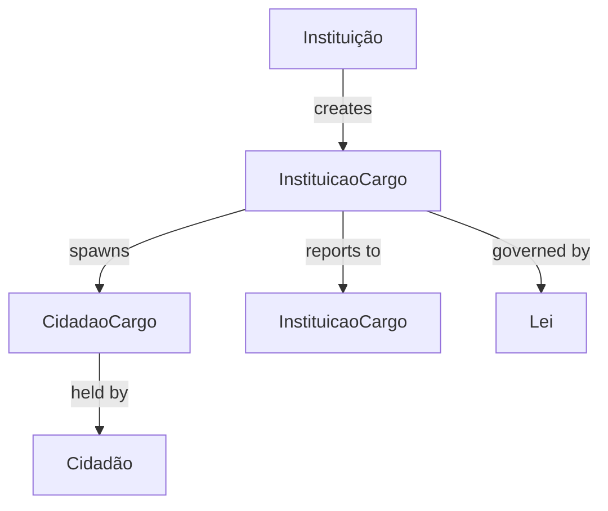
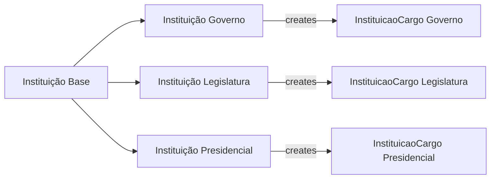
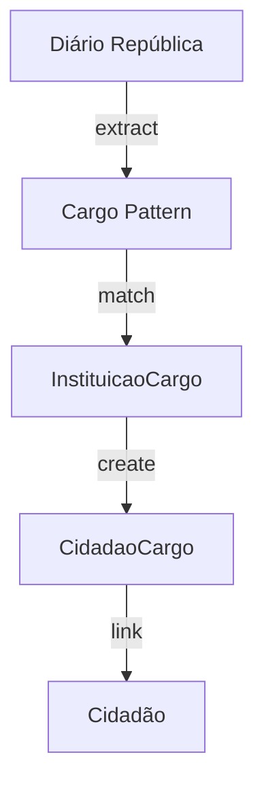

# InstituicaoCargo Entity Documentation

## Overview

`InstituicaoCargo` represents positions/roles within Portuguese state institutions. It's a crucial entity that bridges institutions with the people who hold positions within them, enabling temporal tracking of institutional roles across different governmental periods.

## Core Concept



## Database Schema

### Main Table: `instituicao_cargos`

```sql
CREATE TABLE instituicao_cargos (
    id BIGINT PRIMARY KEY,
    uuid UUID UNIQUE INDEX,
    cargo VARCHAR,
    tipo ENUM('instituicao', 'instituicao_legislatura', 'instituicao_presidencial', 'instituicao_governo'),
    instituicao_id BIGINT,
    cargo_responde_id BIGINT NULL,
    sinopse TEXT NULL,
    params JSON NULL
);
```

#### Key Fields Explained

- `cargo`: Official position title (e.g., "Ministro", "Secretário de Estado")
- `tipo`: Defines the institutional context:
  - `instituicao`: Permanent institutional role
  - `instituicao_legislatura`: Legislative period role
  - `instituicao_presidencial`: Presidential term role
  - `instituicao_governo`: Governmental period role
- `cargo_responde_id`: Hierarchical reporting structure
- `params`: Frontend configuration storage

## Temporal Aspect

The system handles temporal relationships through different institutional contexts:



### Example Flow

1. Base Institution: "Ministério da Educação"
2. Creates Position: "Ministro da Educação"
3. Temporal Instance: "Ministro da Educação do XXIII Governo"
4. Position Holder: "João Costa (2022-present)"

## Related Tables

### `instituicao_cargo_leis`
Links positions to their legal foundations:
```sql
CREATE TABLE instituicao_cargo_leis (
    instituicao_cargo_id BIGINT,
    lei_id BIGINT
);
```

### `instituicao_cargo_anexos`
Stores position-related documents:
```sql
CREATE TABLE instituicao_cargo_anexos (
    uuid UUID UNIQUE,
    nome VARCHAR,
    instituicao_cargo_id BIGINT,
    anexo_tipo_id BIGINT,
    anexo VARCHAR,
    descricao VARCHAR NULL
);
```

## AI Integration Points

### Data Extraction
- Extract position names from legal texts
- Identify reporting relationships
- Map historical position evolution

### Relationship Analysis


### LLM Training Focus
1. **Position Recognition**
   - Legal document parsing
   - Title normalization
   - Historical context understanding

2. **Relationship Mapping**
   - Hierarchical structures
   - Temporal transitions
   - Inter-institutional relationships

## API Endpoints

### Key Queries
```graphql
type InstituicaoCargo {
    cargo: String!
    tipo: CargoTipo!
    instituicao: Instituicao!
    cargoResponde: InstituicaoCargo
    cidadaoCargos: [CidadaoCargo!]!
    leis: [Lei!]!
}
```

### Common Operations
1. Historical position tracking
2. Current position holders
3. Position hierarchy traversal
4. Legal foundation queries

## Usage Examples

### Tracking Ministry Evolution
```sql
SELECT 
    ic.cargo,
    i.nome as instituicao,
    cc.inicio,
    cc.fim,
    c.nome as titular
FROM instituicao_cargos ic
JOIN cidadao_cargos cc ON cc.cargo_id = ic.id
JOIN cidadaos c ON cc.cidadao_id = c.id
JOIN instituicoes i ON ic.instituicao_id = i.id
WHERE ic.cargo = 'Ministro da Educação'
ORDER BY cc.inicio;
```

### Position Hierarchy
```sql
WITH RECURSIVE hierarchy AS (
    SELECT id, cargo, cargo_responde_id, 1 as level
    FROM instituicao_cargos
    WHERE id = [start_id]
    UNION ALL
    SELECT ic.id, ic.cargo, ic.cargo_responde_id, h.level + 1
    FROM instituicao_cargos ic
    JOIN hierarchy h ON ic.cargo_responde_id = h.id
)
SELECT * FROM hierarchy;
```

## Future Enhancements

1. **AI-Driven Features**
   - Automatic position detection in new legislation
   - Historical pattern analysis
   - Relationship prediction

2. **Data Visualization**
   - Organizational charts
   - Historical timelines
   - Network graphs

3. **Integration Opportunities**
   - European Union position mapping
   - International role comparisons
   - Cross-border relationship tracking