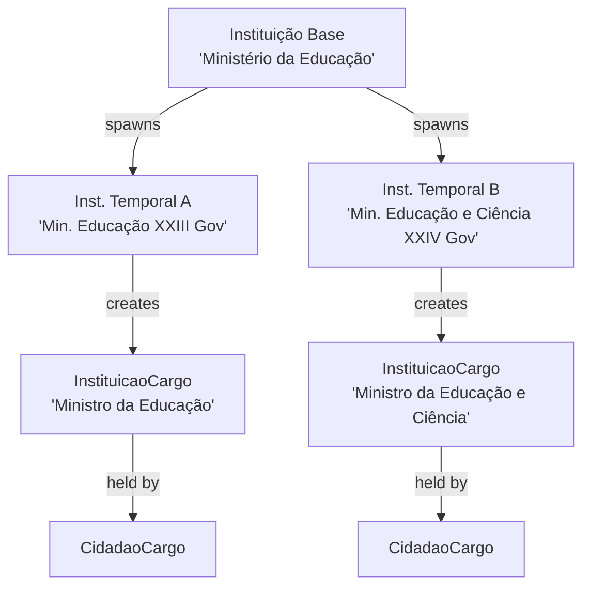
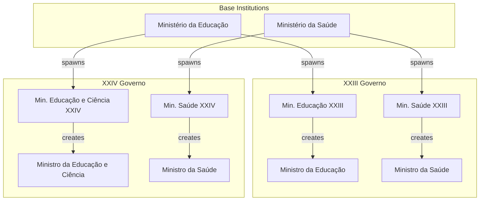
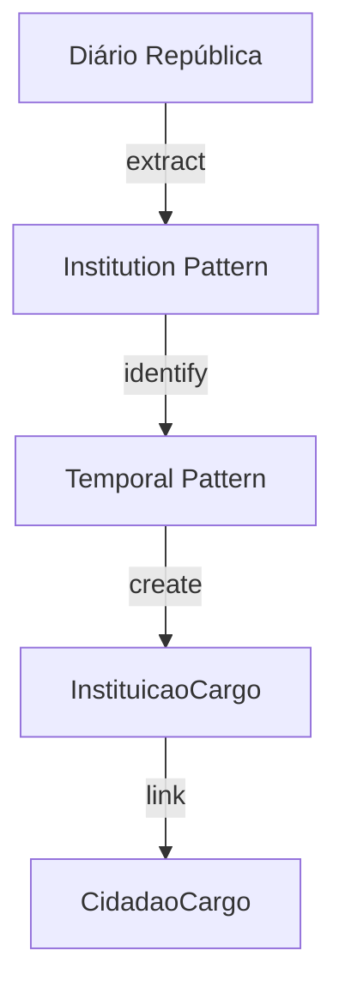

# InstituicaoCargo Entity Documentation

## Overview

`InstituicaoCargo` represents positions/roles within Portuguese state institutions. It's crucial to understand that positions are created by temporal instances of institutions (not base institutions), enabling accurate historical tracking of institutional roles across different governmental periods.

## Core Concept



## Database Schema

### Main Table: `instituicao_cargos`

```sql
CREATE TABLE instituicao_cargos (
    id BIGINT PRIMARY KEY,
    uuid UUID UNIQUE INDEX,
    cargo VARCHAR,
    tipo ENUM('instituicao', 'instituicao_legislatura', 'instituicao_presidencial', 'instituicao_governo'),
    instituicao_id BIGINT,
    cargo_responde_id BIGINT NULL,
    sinopse TEXT NULL,
    params JSON NULL
);
```

#### Key Fields Explained

- `cargo`: Official position title (e.g., "Ministro", "Secretário de Estado")
- `tipo`: Defines the institutional context:
  - `instituicao`: Permanent institutional role
  - `instituicao_legislatura`: Legislative period role
  - `instituicao_presidencial`: Presidential term role
  - `instituicao_governo`: Governmental period role
- `instituicao_id`: Links to the temporal instance of the institution (not the base institution)
- `cargo_responde_id`: Hierarchical reporting structure
- `params`: Frontend configuration storage

## Temporal Instance Model

The system handles temporal relationships through different institutional contexts. Each base institution can spawn multiple temporal instances:



### Example Flow

1. Base Institution: "Ministério da Educação" (permanent concept)
2. Temporal Instance: "Ministério da Educação do XXIII Governo" (specific period)
3. Creates Position: "Ministro da Educação" (tied to this temporal instance)
4. Position Holder: Maps through CidadaoCargo

This model allows:
- Different ministry names across governments
- Different position structures per government
- Accurate historical tracking
- Proper institutional evolution mapping

## Related Tables

### `instituicao_cargo_leis`
Links positions to their legal foundations:
```sql
CREATE TABLE instituicao_cargo_leis (
    instituicao_cargo_id BIGINT,
    lei_id BIGINT
);
```

## Usage Examples

### Tracking Ministry Evolution
```sql
SELECT 
    i_base.nome as instituicao_base,
    i_temp.nome as instituicao_temporal,
    ic.cargo,
    g.nome as governo,
    cc.inicio,
    cc.fim,
    c.nome as titular
FROM instituicoes i_base
JOIN instituicao_governos i_temp ON i_temp.instituicao_id = i_base.id
JOIN governos g ON i_temp.governo_id = g.id
JOIN instituicao_cargos ic ON ic.instituicao_id = i_temp.id
LEFT JOIN cidadao_cargos cc ON cc.cargo_id = ic.id
LEFT JOIN cidadaos c ON cc.cidadao_id = c.id
WHERE i_base.nome = 'Ministério da Educação'
ORDER BY g.inicio, cc.inicio;
```

## AI Integration Points

### Data Extraction
- Track institutional evolution
- Map position changes across governments
- Identify ministry mergers/splits
- Analyze position responsibility changes

### Pattern Recognition


## Future Enhancements

1. **AI-Driven Features**
   - Automatic temporal instance detection
   - Position evolution tracking
   - Institutional transformation analysis

2. **Data Visualization**
   - Institutional timeline views
   - Position evolution diagrams
   - Government transition maps

3. **Integration Opportunities**
   - Cross-government position mapping
   - Historical transformation analysis
   - Responsibility evolution tracking