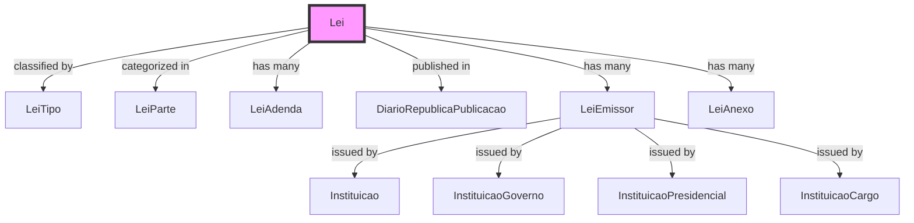
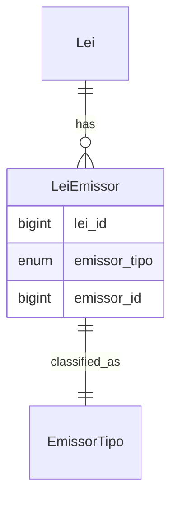
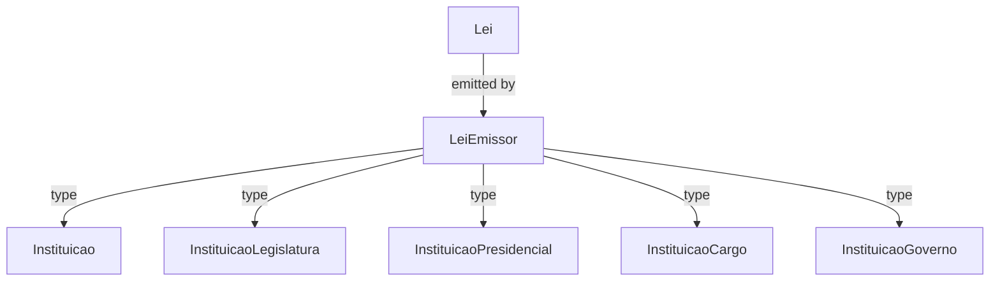
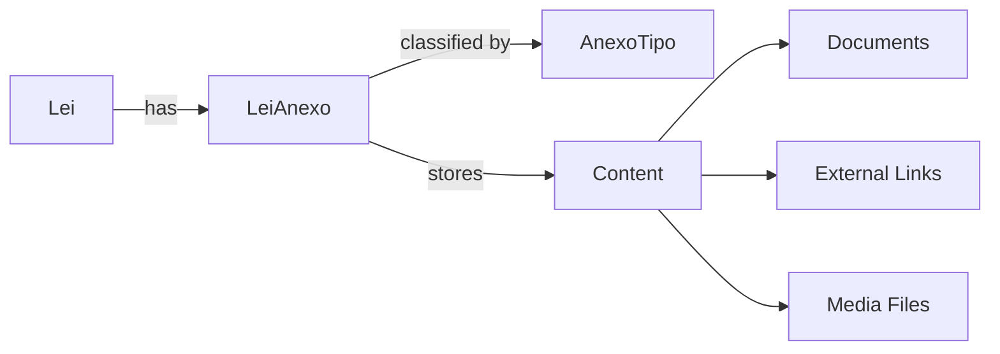

# Lei Entity Documentation

## Overview

The `Lei` entity represents legal documents in the Portuguese legal system. It manages laws, amendments, and their relationships with various institutional entities, providing a comprehensive system for tracking legislation and its impacts across different governmental bodies.

## Core Concept



## Database Schema

### Main Table: `leis`

```sql
CREATE TABLE leis (
    id BIGINT PRIMARY KEY,
    uuid UUID UNIQUE,
    lei_tipo_id BIGINT,
    codigo VARCHAR(255),
    nome_completo VARCHAR(255),
    proponente VARCHAR(255) NULL,
    lei_parte_id BIGINT NULL,
    sumario TEXT NULL,
    texto LONGTEXT NULL,
    em_vigor BOOLEAN DEFAULT true,
    data_toggle DATE NULL,
    created_at TIMESTAMP,
    updated_at TIMESTAMP,
    
    UNIQUE(codigo, lei_tipo_id),
    FOREIGN KEY (lei_tipo_id) REFERENCES lei_tipos(id),
    FOREIGN KEY (lei_parte_id) REFERENCES lei_partes(id)
);

COMMENT ON TABLE leis IS 'Tabela principal de leis, com todas as informações necessárias para a sua consulta e pesquisa.';
```

## Related Entities

### 1. LeiTipo (Law Type)
```php
class LeiTipo extends Model {
    protected $fillable = [
        'uuid',
        'tipo',
        'sinopse'
    ];
}
```

### 2. LeiParte (Law Section)
```php
class LeiParte extends Model {
    protected $fillable = [
        'uuid',
        'codigo',
        'parte',
        'sinopse'
    ];
}
```

### 3. LeiEmissor (Law Issuer)


## Relationships

### Direct Relationships
```php
class Lei extends Model {
    public function diarioRepublicaPublicacao(): BelongsTo {
        return $this->belongsTo(DiarioRepublicaPublicacaoLei::class, 'lei_id');
    }

    public function adendas(): HasMany {
        return $this->hasMany(LeiAdenda::class, 'lei_original_id');
    }

    public function anexos(): HasMany {
        return $this->hasMany(LeiAnexo::class, 'lei_id');
    }

    public function emissores(): HasMany {
        return $this->hasMany(LeiEmissor::class, 'lei_id');
    }

    public function leiTipo(): BelongsTo {
        return $this->belongsTo(LeiTipo::class, 'lei_tipo_id');
    }
}
```

### Polymorphic Relationships


## Content Management

### Document Structure
```yaml
Lei:
  - codigo: "Unique identifier"
  - nome_completo: "Full law name"
  - sumario: "Law summary"
  - texto: "Full legal text"
  - metadata:
      - em_vigor: "Active status"
      - data_toggle: "Status change date"
      - proponente: "Proposing entity"
```

### Attachment System


## Implementation Examples

### Creating a New Law
```php
public function createLei(array $data): Lei {
    $lei = Lei::create([
        'uuid' => Str::uuid(),
        'lei_tipo_id' => $data['tipo_id'],
        'codigo' => $data['codigo'],
        'nome_completo' => $data['nome'],
        'sumario' => $data['sumario'],
        'texto' => $data['texto'],
        'em_vigor' => true
    ]);

    // Add emissores
    foreach ($data['emissores'] as $emissor) {
        $lei->emissores()->create([
            'emissor_tipo' => $emissor['tipo'],
            'emissor_id' => $emissor['id']
        ]);
    }

    return $lei;
}
```

### Managing Amendments
```php
public function addAmendment(Lei $original, Lei $amendment): LeiAdenda {
    return LeiAdenda::create([
        'lei_original_id' => $original->id,
        'lei_adenda_id' => $amendment->id
    ]);
}
```

## Search and Retrieval

### Full-Text Search
```sql
CREATE INDEX idx_lei_texto ON leis USING gin(to_tsvector('portuguese', texto));
CREATE INDEX idx_lei_sumario ON leis USING gin(to_tsvector('portuguese', sumario));
```

### Common Queries
```php
// Active laws by type
Lei::where('em_vigor', true)
   ->where('lei_tipo_id', $tipoId)
   ->get();

// Laws by institution
Lei::whereHas('emissores', function($query) use ($instituicaoId) {
    $query->where('emissor_tipo', 'instituicao')
          ->where('emissor_id', $instituicaoId);
})->get();
```

## API Integration

### Endpoints
```graphql
type Lei {
    uuid: ID!
    codigo: String!
    nome_completo: String!
    sumario: String
    texto: String
    em_vigor: Boolean!
    tipo: LeiTipo!
    emissores: [LeiEmissor!]!
    anexos: [LeiAnexo!]!
    adendas: [Lei!]!
}
```

### Common Operations
1. Law Creation
2. Amendment Management
3. Status Updates
4. Document Attachment
5. Issuer Association

## Future Enhancements

1. **Version Control**
   - Track law changes over time
   - Compare different versions
   - Maintain amendment history

2. **AI Integration**
   - Automatic categorization
   - Summary generation
   - Related law suggestions
   - Impact analysis

3. **Advanced Search**
   - Semantic search capabilities
   - Citation network analysis
   - Legal precedent tracking

4. **Document Processing**
   - Automated structure analysis
   - Reference extraction
   - Cross-reference validation

5. **Reporting System**
   - Impact assessment
   - Coverage analysis
   - Temporal tracking
   - Institution relationship mapping