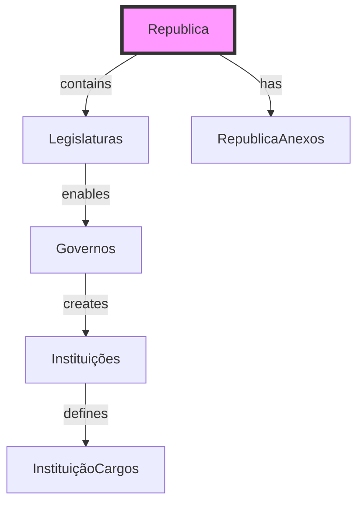
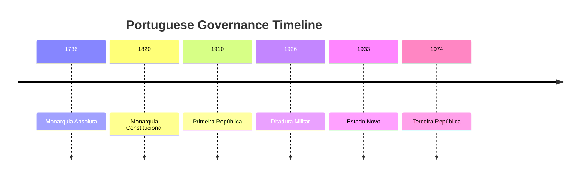
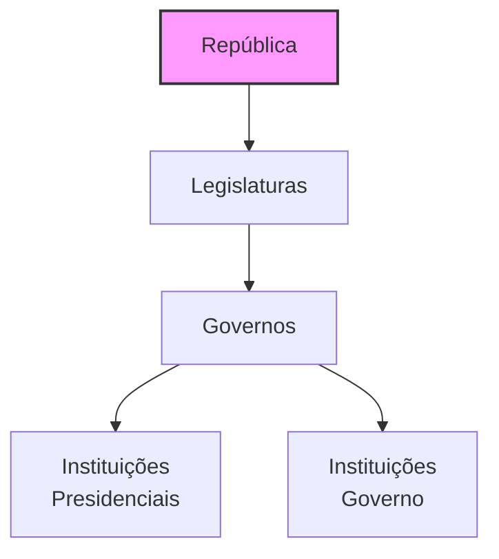
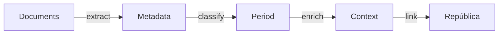

# Republica Entity Documentation

## Overview

`Republica` represents the highest-level temporal division in Portuguese governance history, from Monarquia Absoluta (1736) to the present. Each República period defines a distinct constitutional framework and governmental structure, serving as the root container for Legislaturas, Governos, and institutional arrangements.

## Core Concept



## Database Schema

### Main Table: `republicas`

```sql
CREATE TABLE republicas (
    id BIGINT PRIMARY KEY,
    uuid UUID UNIQUE,
    nome VARCHAR(255) NOT NULL,
    inicio DATE NOT NULL,
    fim DATE NULL,
    sinopse TEXT NULL,
    created_at TIMESTAMP,
    updated_at TIMESTAMP
);

COMMENT ON TABLE republicas IS 'Major periods of Portuguese governance';
```

#### Key Fields Explained

- `nome`: Official period name (e.g., "Primeira República")
- `inicio`: Period start date
- `fim`: Period end date (NULL for current)
- `sinopse`: Period description and key characteristics

## Temporal Aspect

Republicas form the root of all temporal relationships:



### Period Structure



## Related Tables

### `legislaturas`
Parliamentary terms within each República:
```sql
CREATE TABLE legislaturas (
    id BIGINT PRIMARY KEY,
    uuid UUID UNIQUE,
    republica_id BIGINT,
    nome VARCHAR(255),
    sigla VARCHAR(50),
    eleicoes DATE,
    formacao DATE,
    dissolucao DATE,
    sinopse TEXT NULL
);
```

### `republica_anexos`
Period-specific attachments:
```sql
CREATE TABLE republica_anexos (
    id BIGINT PRIMARY KEY,
    uuid UUID UNIQUE,
    republica_id BIGINT,
    anexo_tipo_id BIGINT,
    anexo VARCHAR(255),
    nome VARCHAR(255),
    descricao TEXT NULL
);
```

## AI Integration Points

### Historical Analysis
- Constitutional framework changes
- Governance pattern recognition
- Period transition analysis

### Document Processing


### LLM Training Focus
1. **Period Recognition**
   - Constitutional markers
   - Governance transitions
   - Historical context

2. **Document Classification**
   - Period-specific terminology
   - Constitutional references
   - Administrative structures

## API Endpoints

### Core Queries
```graphql
type Republica {
    uuid: ID!
    nome: String!
    inicio: Date!
    fim: Date
    sinopse: String
    legislaturas: [Legislatura!]
    anexos: [RepublicaAnexo!]
}
```

### Common Operations
1. Period timeline retrieval
2. Constitutional framework analysis
3. Governance structure mapping
4. Document management

## Usage Examples

### Period Timeline Query
```sql
SELECT 
    r.nome AS periodo,
    r.inicio,
    r.fim,
    COUNT(l.id) as num_legislaturas,
    COUNT(DISTINCT g.id) as num_governos
FROM republicas r
LEFT JOIN legislaturas l ON r.id = l.republica_id
LEFT JOIN governos g ON l.id = g.legislatura_id
GROUP BY r.id
ORDER BY r.inicio;
```

### Governance Structure
```sql
WITH RECURSIVE governance_tree AS (
    SELECT 
        r.id,
        r.nome as structure_name,
        'republica' as level,
        1 as depth
    FROM republicas r
    WHERE r.id = [republica_id]
    
    UNION ALL
    
    SELECT 
        i.id,
        i.nome,
        'instituicao',
        gt.depth + 1
    FROM instituicoes i
    JOIN governance_tree gt ON i.republica_id = gt.id
)
SELECT * FROM governance_tree;
```

## Future Enhancements

1. **AI-Powered Features**
   - Constitutional analysis tools
   - Period comparison engine
   - Transition pattern detection

2. **Analytics Capabilities**
   - Governance evolution visualization
   - Institution lifecycle tracking
   - Period impact assessment

3. **Integration Opportunities**
   - Historical document processing
   - Constitutional framework analysis
   - International governance comparison